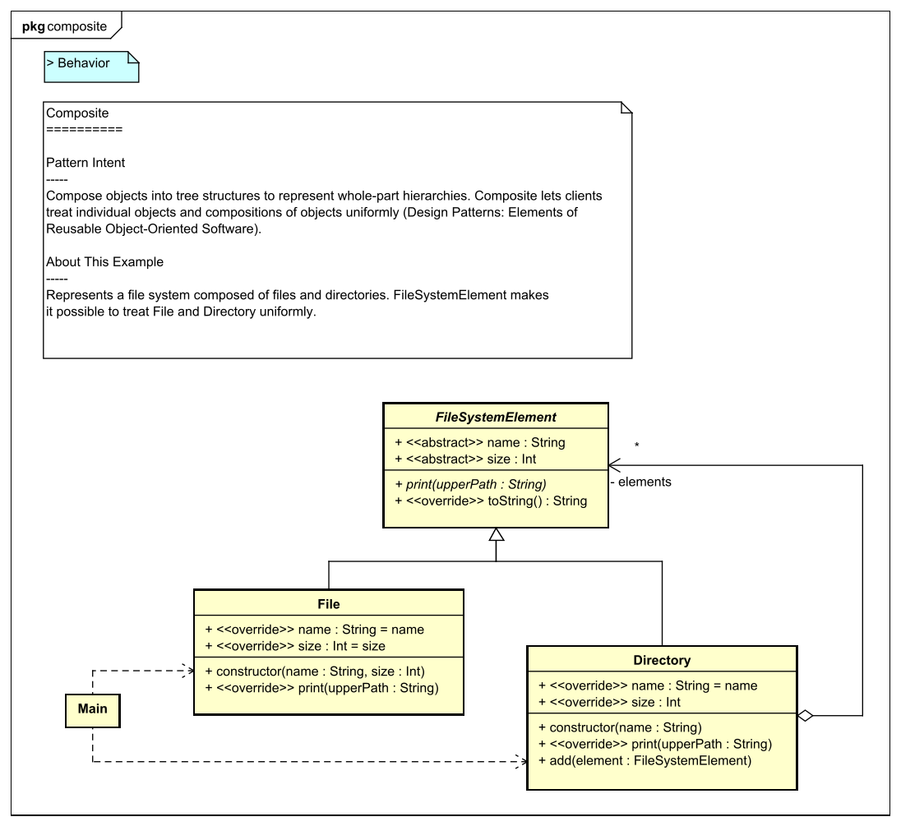
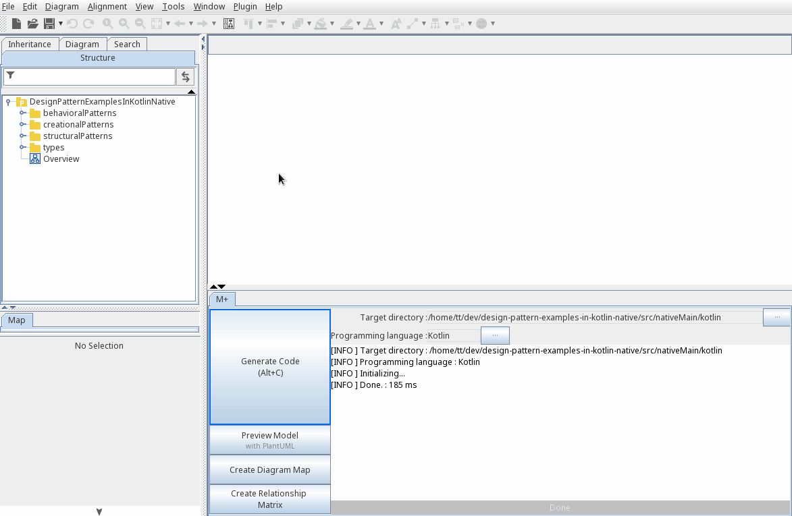
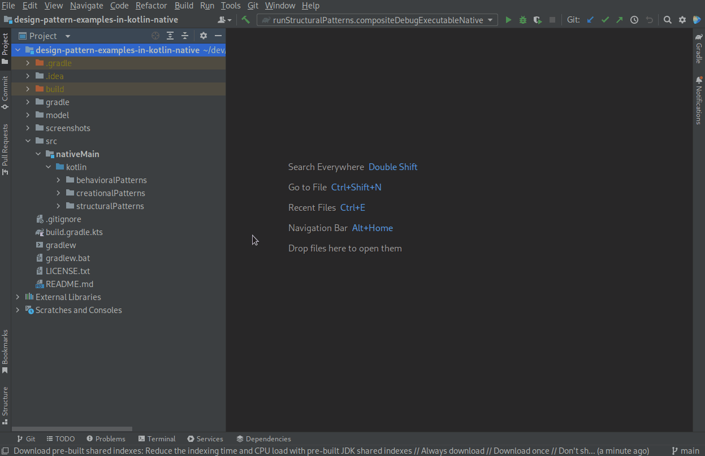

[](https://raw.githubusercontent.com/takaakit/design-pattern-examples-in-kotlin-native/master/screenshots/AllPatterns.svg)

Design Pattern Examples in Kotlin/Native
===

Model and code examples of GoF Design Patterns for Kotlin/Native.  
This project is available for the following objectives:  

* To understand GoF Design Pattern examples in Kotlin/Native.
* To understand the mapping between UML model and Kotlin/Native code.
* To try model-driven development (MDD) using Astah and m plus plug-in.

**NOTE: The code examples use GTK4 and work on Ubuntu 22 (x86_64) and Fedora 36 (x86_64).**

> UML model example:



<a id="code-example"></a>
> Kotlin/Native code example:

```kotlin
package structuralPatterns.composite
// ˅
// ˄

abstract class FileSystemElement {
    // ˅
    // ˄

    abstract val name: String
        // ˅
        
        // ˄

    abstract val size: Int
        // ˅
        
        // ˄

    // Print this element with the "upperPath".
    abstract fun print(upperPath: String)

    override fun toString(): String {
        // ˅
        return "$name ($size)"
        // ˄
    }

    // ˅
    
    // ˄
}

// ˅

// ˄
```

Installation on Ubuntu/Fedora
------------
*NOTE*: The code examples work on Ubuntu 22 (x86_64) and Fedora 36 (x86_64).

**UML Modeling Tool**
* Download the modeling tool [Astah](https://astah.net/download) UML/Professional **ver.10.0.0** or higher, and install.  
* Download [m plus](https://sites.google.com/view/m-plus-plugin/download) plug-in **ver.3.1.3-preview.1** or higher, and add it to Astah.  
  [How to add plugins to Astah](https://astahblog.com/2014/12/15/astah_plugins/)

**Kotlin/Native Development Environment**
* Download and install [IntelliJ](https://www.jetbrains.com/help/idea/installation-guide.html#71f1f9f8).  
* Run the following command to install GTK4 development libraries.  
  Ubuntu 22
  ```bash
  sudo apt install libgtk-4-dev libncurses5 gcc-multilib
  ```
  Fedora 36
  ```bash
  sudo dnf install gtk4-devel ncurses-compat-libs
  ```

Usage on Ubuntu/Fedora
-----
*NOTE*: The code examples work on Ubuntu 22 (x86_64) and Fedora 36 (x86_64).

**Code Generation from UML**
  1. Open the Astah file (model/DesignPatternExamplesInKotlinNative.asta).
  2. Select model elements on the model browser of Astah.
  3. Click the **Generate Code** button.  
    
  The generated code has **User Code Area**. The User Code Area is the area enclosed by "˅" and "˄". Handwritten code written in the User Code Area remains after a re-generation. [View code example](#code-example).  
  For detailed usage of the tools, please see [Astah Manual](https://astah.net/manual) and [m plus plug-in tips](https://sites.google.com/view/m-plus-plugin-tips).

**Build and Run**
  1. Open the project root directory (design-pattern-examples-in-kotlin-native) in IntelliJ.
  2. Open `Main.kt` for the pattern you want to run, and click `Run` icon in the left gutter.
       

References
----------
* Gamma, E. et al. Design Patterns: Elements of Reusable Object-Oriented Software, Addison-Wesley, 1994
* Hiroshi Yuki. Learning Design Patterns in Java [In Japanese Language], Softbank publishing, 2004

License
-------
This project is licensed under the Creative Commons Zero (CC0) license. The model and code are completely free to use.

[](https://creativecommons.org/publicdomain/zero/1.0/deed)

Other Language Examples
-----------------------
[C++](https://github.com/takaakit/design-pattern-examples-in-cpp), [C#](https://github.com/takaakit/design-pattern-examples-in-csharp), [Crystal](https://github.com/takaakit/design-pattern-examples-in-crystal), [Go](https://github.com/takaakit/design-pattern-examples-in-golang), [Java](https://github.com/takaakit/design-pattern-examples-in-java), [JavaScript](https://github.com/takaakit/design-pattern-examples-in-javascript), [Python](https://github.com/takaakit/design-pattern-examples-in-python), [Kotlin/JVM](https://github.com/takaakit/design-pattern-examples-in-kotlin), [Ruby](https://github.com/takaakit/design-pattern-examples-in-ruby), [Scala](https://github.com/takaakit/design-pattern-examples-in-scala), [Swift](https://github.com/takaakit/design-pattern-examples-in-swift), [TypeScript](https://github.com/takaakit/design-pattern-examples-in-typescript)
